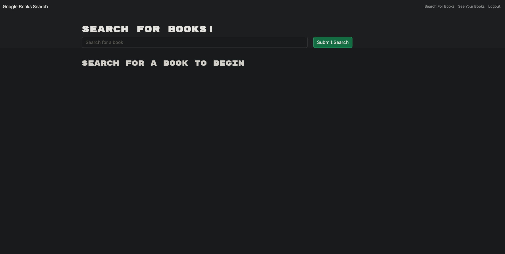

# plot-a-book

## Table of Contents:
[description](#desc)

[Installation](#1)

[Usage](#2)

[Credits](#3)

[License](#4)

[Contributing](#5)

[Tests](#6)

[Questions](#7)

# 
## 0.Description:

an online application that allows one to search for books, then store them in an account they create! This application also allows for the removal of saved books!
[check it out!](https://plot-a-book.herokuapp.com/)
# 
## 1.Installation:
considering this application will be hosted on heroku you shouldnt need to install anything
# 
## 2.Usage:
Just create an account and search for books and youll be good to go!
# 
## 3.Credits:
The conversion from a restful api to one that utilizes graphql were all done by mkalik.
Some starter code was provided which can be found [here](https://github.com/coding-boot-camp/solid-broccoli)
# 
## 4.License:
https://opensource.org/licenses/MIT
# 
## 5.How to contribute:
none
# 
## 6.Tests:
If you want to clone this repo and do some of your own work on it, run npm install in the root directory of this application.\
This will install all of the neccesary packages for the client and the server.
You can then run-npm run develop-and the client and server will do what they need to and get started.
(if you run into some sort of error along the lines of=>'error:0308010C:digital envelope routines::unsupported'\
you can find a fix [here](https://stackoverflow.com/questions/69692842/error-message-error0308010cdigital-envelope-routinesunsupported))
# 
## 7.Questions:
Please contact me here [github](https://github.com/mkalik)
